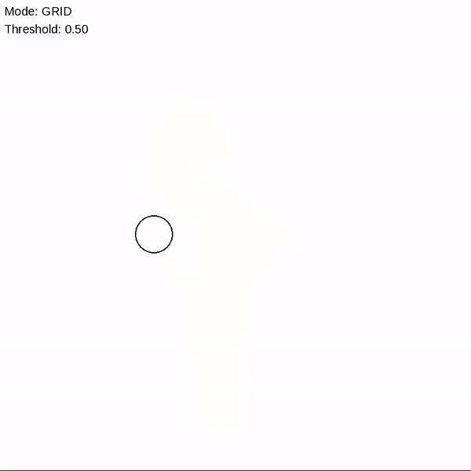

### Marching Squares

Marching Squares is an algorithm that takes a grey-scale image (a 2D grid with values between 0 and 1) and a threshold as input. It returns the contour at that threshold. In general, it returns level sets of
scalar fields R^2 -> R.

It can be extended to 3D (marching cubes) to generate a surface area from
a scalar field (R^3 -> R). The surface can then be rendered using standard techniques of computer graphics (projecting triangles)

#### DEMO

#### Features

- paint with left click / remove with right click
- adjust the brush radius (kernel radius) using the mouse wheel
- Press G (grid mode), I (interpolating contours) and C (contours)
- Press the up (down) arrow key to increase (decrease) the threshold